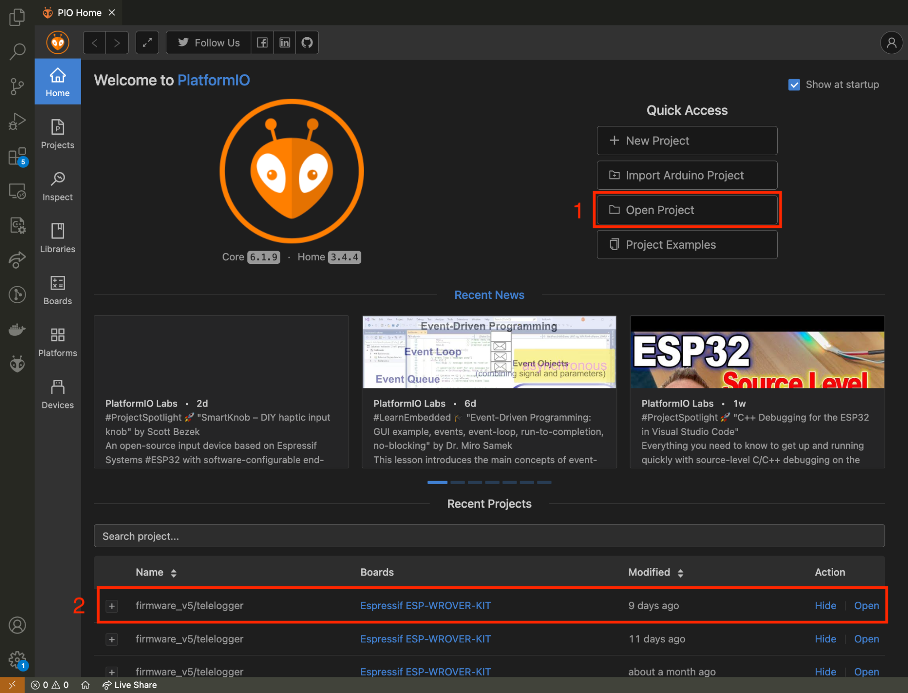
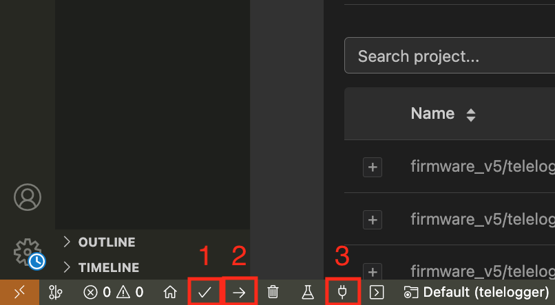

&nbsp;
&nbsp;
<p align="center">
  
</p> 

&nbsp;

# Classifiying Driver behavior with Autocloud in Freematics One+

Determining whether a driver is operating a vehicle aggressively and pinpointing, for instance, which segment of a route they could drive more cautiously to save fuel, optimize vehicle resources, and reduce environmental impact is of interest to various individuals and businesses. Now, envision accomplishing this in real-time using Internet of Things (IoT) technology!

With this in mind, this repository contains an implementation of the Autocloud algorithm designed to run online on the Freematics ONE+. Clustering is performed using a soft sensor called the "radar chart area," essentially an indicator of vehicle resource utilization based on speed, throttle position, engine load, and rpm sensors. Once the area is calculated, the TEDA algorithm first checks if it is an outlier, and if not, it is grouped by Autocloud.

However, each driver exhibits a unique profile, not to mention that the same driver may drive differently depending on factors such as the route, traffic, weather, etc. This phenomenon, known as concept drift, needs to be addressed in real-time. In this regard, the concept of a dynamic window was introduced, where the latest outlier in a window becomes the center of the most typical cloud related to it, defining the window reset.

## :rocket: How to Execute

1 - Install [Visual Studio Code](https://code.visualstudio.com/)

2 - Install [PlatformIO](https://platformio.org/) (VSCode Extension)

3 - Clone this repository

```bash
git clone https://github.com/conect2ai/freematics-autcloud.git
```

4 - Open `freematics-autcloud/firmware_v5/telelogger` project folder in PlatformIO, as shown in the figure below.

<p align="center">
  
</p> 


5 - Connect the Freematics One+ with the computer and power up it with the Freematics Emulator or in the vehicle.

6 - Compile, Upload and monitor serial (steps 1, 2 and 3, respectively in the figure below).

<p align="center">
  
</p> 

## :computer: Algorithm configuration

In the [telelogger.ino file](./firmware_v5/telelogger/telelogger.ino), you can customize the algorithms for your application. For example:

- To modify the reset windown lenght, you can change the value of this variable:
```C
int max_outlier_window = 4;
```

- To modify the TEDA's sensibility, you modify the initialization parameter:
```C
TEDA teda(2.0);
```

- To modify the sensors used in radar area calculation, you can modify the function and the struct below:

```C
typedef struct {
  float rpm;
  float speed;
  float throttle;
  float engine;
} RADAR_DATA;

float calculate_area(RADAR_DATA& radar_data){
    float rpm = radar_data.rpm / 100.0;
    float speed = radar_data.speed;
    float throttle = radar_data.throttle;
    float engine = radar_data.engine;

    float valuesNormalized[4] = {rpm, speed, throttle, engine};
    float area = 0.5 * std::abs(
        valuesNormalized[0] * valuesNormalized[1] +
        valuesNormalized[1] * valuesNormalized[2] +
        valuesNormalized[2] * valuesNormalized[3] +
        valuesNormalized[3] * valuesNormalized[0]
    ) * std::sin(2 * M_PI / 4);

    return area;
}
```

- To modify the sensors and the times they are collected:

```C
PID_POLLING_INFO obdData[]= {
  {PID_SPEED, 1},
  {PID_RPM, 1},
  {PID_THROTTLE, 1},
  {PID_ENGINE_LOAD, 1}
};
```

## :wrench: Network Configurations

All the information collected can be send to a server and can be stored locally in SD card. The hardware allows information to be sent both via Wi-Fi and 4G. You can configure things like Wi-Fi name and password, URL server, server port, protocol etc. in [config.h file](./firmware_v5/telelogger/config.h).

```C
/**************************************
* Networking configurations
**************************************/
#ifndef ENABLE_WIFI
#define ENABLE_WIFI 0
// WiFi settings
#define WIFI_SSID "FREEMATICS"
#define WIFI_PASSWORD "PASSWORD"
#endif 

#ifndef SERVER_HOST
// cellular network settings
#define CELL_APN ""
// Freematics Hub server settings
#define SERVER_HOST "hub.freematics.com"
#define SERVER_PROTOCOL PROTOCOL_UDP
#endif

// SIM card setting
#define SIM_CARD_PIN ""

// HTTPS settings
#define SERVER_METHOD PROTOCOL_METHOD_POST
#define SERVER_PATH "/hub/api"

#if !SERVER_PORT
#undef SERVER_PORT
#if SERVER_PROTOCOL == PROTOCOL_UDP
#define SERVER_PORT 8081
#elif SERVER_PROTOCOL == PROTOCOL_HTTP
#define SERVER_PORT 80
#elif SERVER_PROTOCOL == PROTOCOL_HTTPS
#define SERVER_PORT 443
#endif
#endif

// WiFi Mesh settings
#define WIFI_MESH_ID "123456"
#define WIFI_MESH_CHANNEL 13

// WiFi AP settings
#define WIFI_AP_SSID "TELELOGGER"
#define WIFI_AP_PASSWORD "PASSWORD"
```

## :page_facing_up: License

This project is licensed under the MIT License - see the [LICENSE](LICENSE) file for details.

# About Us

The [**Conect2AI**](http://conect2ai.dca.ufrn.br) research group is composed of undergraduate and graduate students from the Federal University of Rio Grande do Norte (UFRN) and aims to apply Artificial Intelligence (AI) and Machine Learning in emerging fields. Our expertise includes Embedded Intelligence and IoT, optimizing resource management and energy efficiency, contributing to sustainable cities. In energy transition and mobility, we apply AI to optimize energy use in connected vehicles and promote more sustainable mobility.
